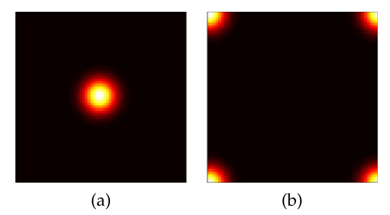
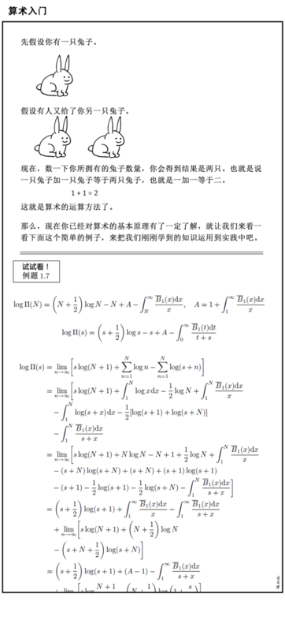
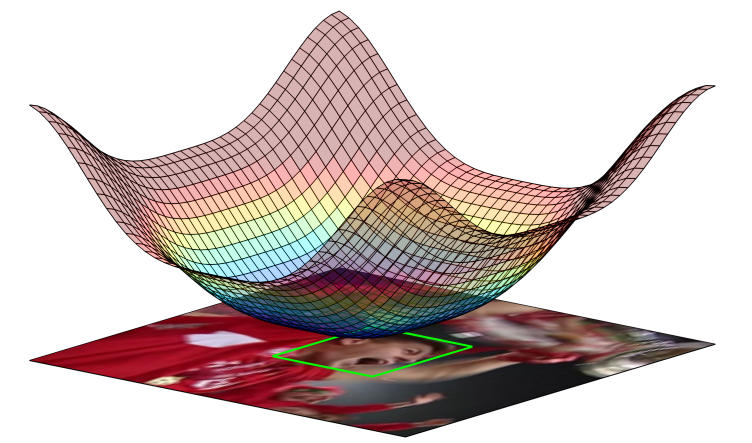
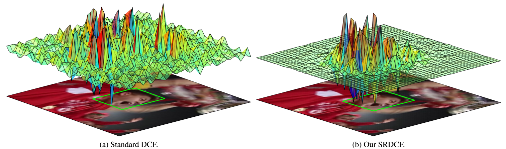
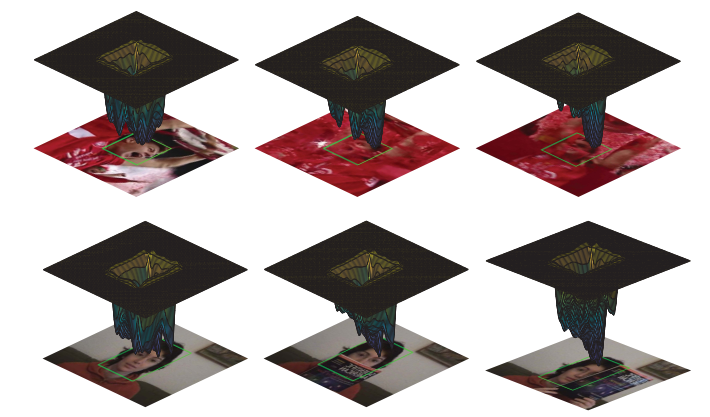
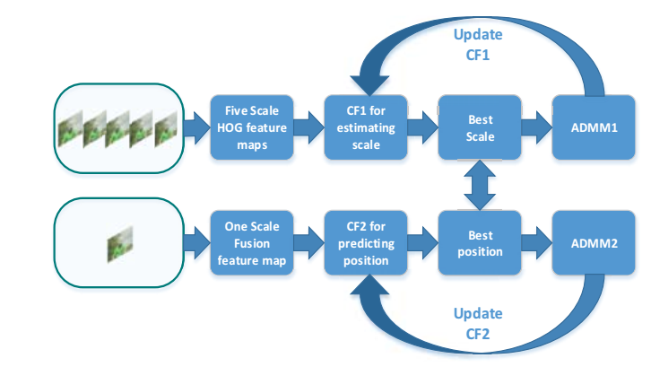
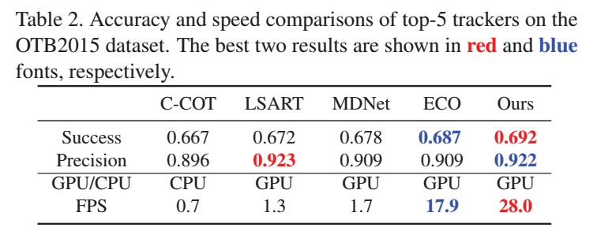
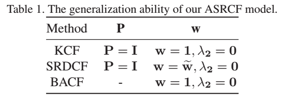
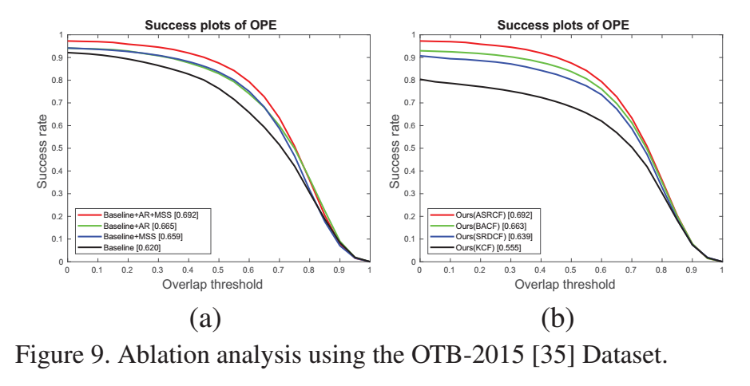
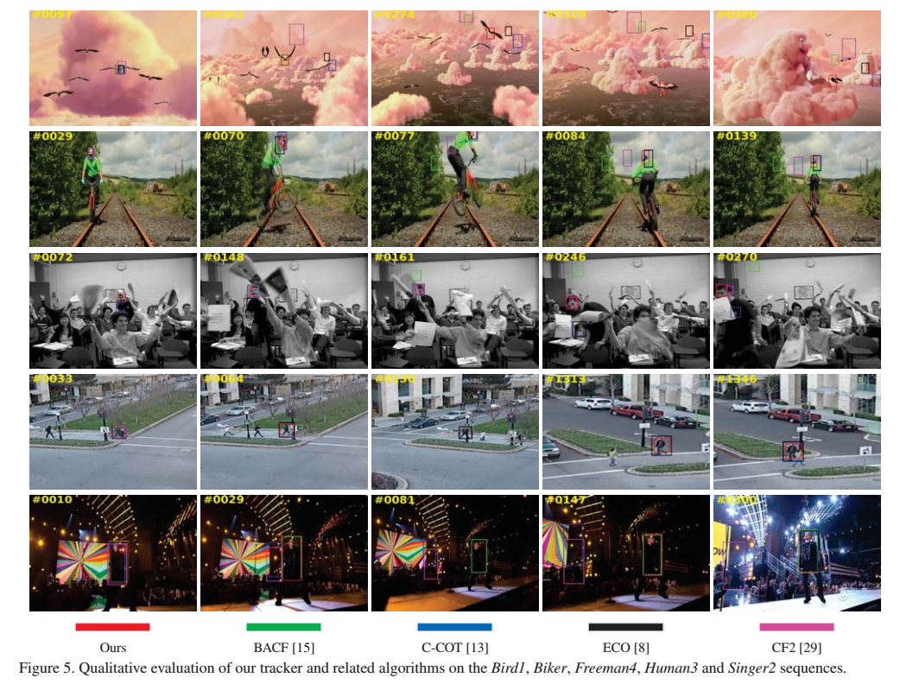

<!-- $theme: gaia -->
# 相关滤波视觉跟踪
#### 姜山
##### 2019.06.15
---
# 目录
- 什么是相关滤波
- CVPR2019 ASRCF
- 改进方向和工作困惑
---
### 什么是相关滤波
#### 互相关
- 只讨论$A$和$B$维度相同的情况，$A,B\in\mathbb{R}^{m\times n}$
- 二维矩阵$C=A*B$, 则$C[i,j]=\sum_{p=0}^{m-1} \sum_{q=0}^{n-1} circ(A,i,j)[p,q]B[p,q]$
- $circ(A,i,j)$指将$A$行上移位$i$，列上移位$j$，例如对下面这个矩阵循环移位1, 2
$$
\begin{bmatrix}
8 & 1 & 6\\
3 & 5 & 7\\
4 & 9 & 2
\end{bmatrix}\longrightarrow
\begin{bmatrix}
4 & 9 & 2\\
8 & 1 & 6\\
3 & 5 & 7
\end{bmatrix}\longrightarrow
\begin{bmatrix}
9 & 2 & 4\\
1 & 6 & 8\\
5 & 7 & 3
\end{bmatrix}
$$
---
### 什么是相关滤波
- 如果真的按照上面的定义计算互相关，复杂度$O(m^2n^2)$
- 根据卷积定理，$F(A*B)=conj(F(A))\odot F(B)$
- 点乘 $C=A\odot B, C[i,j]=A[i,j]B[i,j]$
- 通过快速傅里叶变换计算相关，复杂度$O(mn\log(mn))$，减轻了计算负担
---
### 什么是相关滤波
- 验证一下
# 
---
### 什么是相关滤波
- 训练样本$\mathbf{x}$一个滤波器$\mathbf{h}$，使得$\mathbf{h}$与$\mathbf{x}$的点积接近1，$\mathbf{h}$与$\mathbf{x}$的其他循环移位的点积接近0
- 最小化损失函数$||\mathbf{h*x-y}||^2+\lambda||\mathbf{h}||^2$
- 目标函数$\mathbf{y}$为高斯函数，$\mathbf{y}[0,0]=1$
  
---
### 什么是相关滤波
- 滤波器$\mathbf{h}$训练式$F(\mathbf{h})=\frac{conj(F(\mathbf{y}))\odot F(\mathbf{x})}{conj(F(\mathbf{x}))\odot F(\mathbf{x})+\lambda}$
- 进入下一帧，在上一帧的目标位置上采集样本$\mathbf{z}$, 若目标相对第一帧移动了[y,x]，则$\mathbf{h}$循环移位[y,x]与$\mathbf{z}$的点积最接近1，换言之，$\mathbf{h}*\mathbf{z}$在[y,x]位置上的值最大。
- 计算响应$\mathbf{r}=F^{-1}(F(\mathbf{h})\odot F(\mathbf{z}))$, 寻找$\mathbf{r}$上最大元素的位置[y,x]，则目标相对第一帧的位移为[y,x]
---
### 什么是相关滤波
- 验证一下
# 
---
 
---
---
### CVPR2019 ASRCF
#### ICCV 2015 SRDCF(Martin Danelljan et al.)
- 循环移位假设使得滤波器的训练可以通过快速傅里叶变换加速，也对跟踪效果带来了一些负面作用。
- 由于搜索区域限制，无法应对目标的快速移动
- 由于缺少真实负样本，训练的滤波器容易对目标过拟合，造成目标变形等情况下跟踪失败
- 这些训练和检测中的局限性降低了跟踪器在遮挡等情况下重新检测到目标的能力。
- 单纯增大训练和检测的图像区域会导致训练的正样本中包含过多背景信息, 降低模型的判别能力
---
### CVPR 2019 ASRCF
#### SRDCF
- 马丁大神的解决方法是：惩罚边缘上的滤波器系数
- $$E(\mathbf{h})=\frac 12||\sum_{l=1}^d\mathbf{h}_l*\mathbf{x}_l-\mathbf{y}||^2+\frac 12\sum_{l=1}^{d}||\mathbf{w}\odot \mathbf{h}_l||^2$$
- 惩罚系数$\mathbf{w}$为二次函数

---
### CVPR 2019 ASRCF
#### SRDCF
- SRDCF学习到的滤波器系数与标准DCF学习到的滤波器系数对比

- 搜索区域扩大，训练和测试的样本长宽为$\sqrt{4MN}$,其中$M,N$为样本长和宽
- 训练中没有利用傅里叶变换加速，速度过慢
- 是C-COT和ECO的前身
---
### CVPR 2019 ASRCF
#### ICCV 2017 BACF(Galoogahi et al.)
- $$E(\mathbf{h})=\frac 12||\sum_{l=1}^d (\mathbf{P}^T\mathbf{h}_l)*\mathbf{x}_l-\mathbf{y}||^2+\frac{\lambda}{2}||\mathbf{h}||^2$$
- $P$为二值矩阵，裁剪滤波器的中心区域
- 以上两种滤波器约束方式的缺点：对不同物体采用相同的约束系数，且在跟踪过程中约束系数不变。这样的约束系数没有挖掘不同物体在不同帧中的差异信息
- 作者提出跟踪过程中自适应的空域正则化系数
---
### CVPR 2019 ASRCF
- Dai et al. Visual Tracking via Adaptive Spatially-Regularized Correlation Filters
- $$
  \begin{aligned}
  E(\mathbf{h},\mathbf{w})&=\frac 12||\mathbf{y}-\sum_{l=1}^d \mathbf{x}_l *(\mathbf{P}^T\mathbf{h}_l)||^2+ \\
  						  &\frac{\lambda_1}{2}\sum_{l=1}^d||\mathbf{w}\odot \mathbf{h}_l||^2+\frac{\lambda_2}{2}||\mathbf{w}-\mathbf{w}^r||^2	
  \end{aligned}
$$
- $\mathbf{w}^r$为参考空域正则化系数
- 使用ADMM求解，线性更新$\mathbf{x}$，每帧更新$\mathbf{w}^r\leftarrow \mathbf{w}$
---
### CVPR 2019 ASRCF
- 自适应空间惩罚系数对目标上不可靠的区域进行惩罚，使滤波器更专注于可靠的区域
 
---
### CVPR 2019 ASRCF
- 论文的另一贡献：浅层特征尺度估计，使用HOG+CNN特征(VGG-M的Norm1, VGG-16的Conv4-3)确定位置，只使用HOG特征确定尺度
- 原因：在多尺度上提取CNN特征耗时，且深层CNN特征丢失了空间细节信息

---
### CVPR 2019 ASRCF
- 实验:28fps
- 五个数据集：OTB2015, TC128, VOT2016, VOT2017, LaSOT(1400个视频, 3.5M帧)
 
---
### CVPR 2019 ASRCF
- 消融分析（Ablation analysis）
 
- KCF, SRDCF, BACF均为所提出形式的特殊情况
- Baseline：无自适应正则化，无浅层特征尺度估计
- Baseline+MSS: 有浅层特征尺度估计
- Baseline+AR: 有自适应正则化
- Baseline+AR+MSS: 最终版本 
---
### CVPR 2019 ASRCF
- 消融分析（Ablation analysis）
 
---
### CVPR 2019 ASRCF
- 定性分析

---
### 改进方向和工作困惑
- 暂时思路：用以上正则化相关滤波算法作为更强的baseline
- 长时跟踪中的更新机制：现有大部分算法选择在跟踪结果可靠时更新，在跟踪结果不可靠时不更新或保守更新，防止遮挡，快速运动等情况下模型的污染，但目标发生变形，旋转等情况时，模型应当快速更新，如何判断跟踪过程中状态
- 长时跟踪中的重检测：目标在遮挡或出视野后再次出现，若没有出现在滤波器的搜索范围内，则不会被重新跟踪
- 参考TLD,PTAV，在跟踪过程中以一定频率训练检测器，在视频中全局检测
---
### 改进方向和工作困惑
- 尺度估计：LDES算法中的尺度估计可同时估计目标尺度和旋转，相比多尺度金字塔方法不稳定，在相机抖动等情况下易造成尺度估计失败
- 通道可靠性：在多通道特征中，对可靠的通道乘以较大权重，对不可靠通道乘以较小权重
- 进一步完善对颜色直方图特征的利用，staple算法仅仅是将CF响应和颜色响应以固定比例加权，能否自适应？
- 使用颜色直方图完善尺度估计，参考DAT，实现宽高比自适应
- 如何兼顾速度和效果
---
### 工具推荐
- Marp: 用Markdown编写PPT
- PasteEx: 直接将剪贴板中的文本，图片粘贴成文件