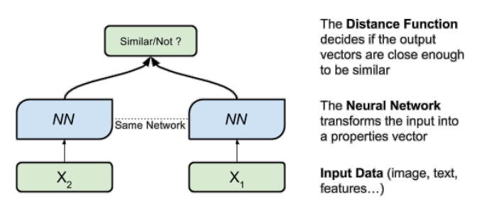
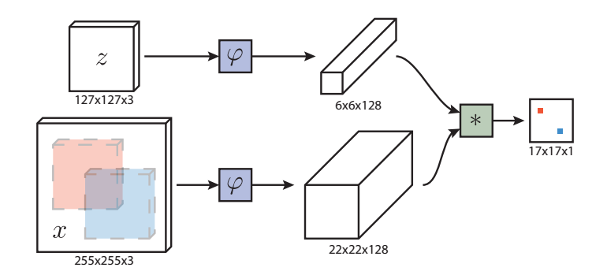
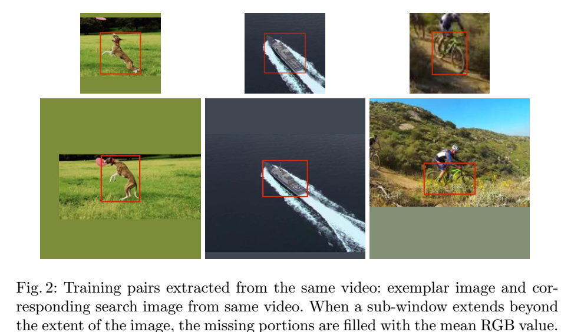
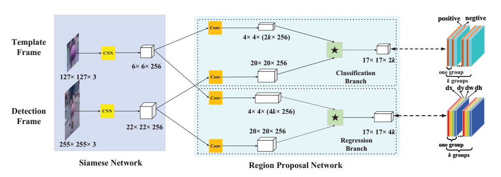
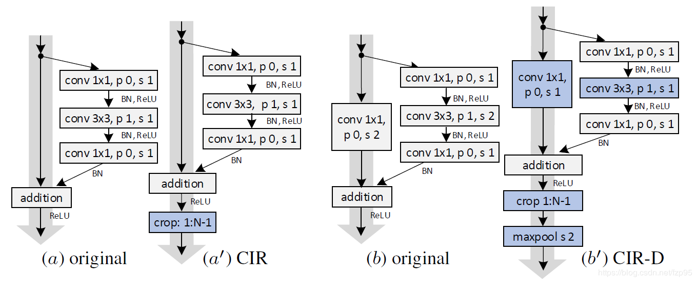
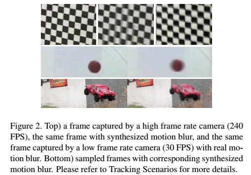
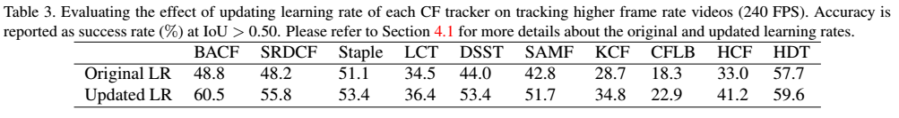
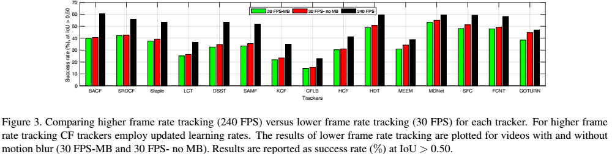

<!-- $theme: gaia -->
## Siamese网络在视觉跟踪中的应用
#### 姜山
#### 2019.07.14
---
### 什么是Siamese网络
- 权重共享
- 度量学习(属于同一物体相似度大，不同物体相似度小)
- 应用于人脸验证，重识别(Re-ID)

---
### Siamese FC(全卷积孪生网络)
- 模板图和搜索区域
- 卷积特征进行互相关，互相关结果包含搜索区域上每个位置与模板图的相似度

---
### Siamese FC
- 保持全卷积特性（不能加padding）
- 使用ImageNet Video Dataset进行训练
- 训练样本为模板-搜索区域对

---
### Siamese FC
- 训练损失函数(Logistic Loss)
 $l(y,v)=\log(1+\exp(-yv))$
 $L(y,v)=\frac{1}{|D|}\sum_{u\in D}l(y[u],v[u])$
- 训练目标
$
y[u]=\begin{cases}
+1, & k||u-c||\leq R\\
-1, & otherwise
\end{cases}
$

---
### Siamese FC
- score map通过双三次插值到原尺寸.
- 尺度自适应：在多个尺度上检测$1.025^{\{-2,-1,0,1,2\}}$
- embedding function: AlexNet
- 单GPU上速度58~86 fps
- Siamese网络特点：无需模型更新
---
### Siamese RPN
- 类似Faster-RCNN
- 一个分类分支和一个目标框回归分支
- 选出最大的K个anchor, 非极大值抑制(NMS)
- 宽高比自适应

---
### SiameDW
- Siamese网络不能应用更深网络的原因：padding会破坏平移不变性
- 提出CIR模块，通过裁剪中心减小padding的影响

---
### DaSiamRPN
- 在损失函数中加入相似物干扰抑制
### SiamRPN++
- 训练中spatial aware采样策略
- Layer-wise Aggregation
- Depthwise Cross Correlation
---
### NFS数据集
- Need for Speed: A Benchmark for Higher Frame Rate Object Tracking
- 现有跟踪数据集大多在较低帧率(30fps)下采集的视频
- 在较高帧率的视频下，使用手工特征的相关滤波跟踪算法超过了基于深度学习的跟踪算法
- 用iPhone和iPad采集了75个240fps的视频进行实验
- 间隔8帧采样模拟较低帧率视频
- 用AE(Adobe After Effects)模拟运动模糊
---
### NFS数据集

---
---
### NFS数据集
- 在较高帧率的数据集上，CF学习率调整为通常学习率的1/8会有较大提升

- CF类跟踪算法在较高帧率视频上性能有较大提升，而深度学习类算法提升不明显

---
### NFS数据集
- In simple terms: the accuracy of a 240 FPS tracker cannot be truly appreciated until it is run on a 240 FPS video!
- 在系统设计中，应将帧率作为一项资源进行权衡