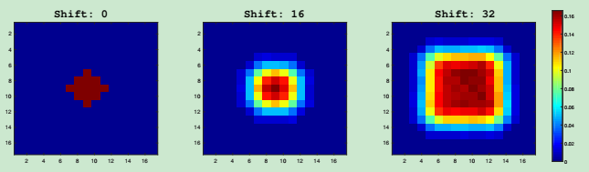
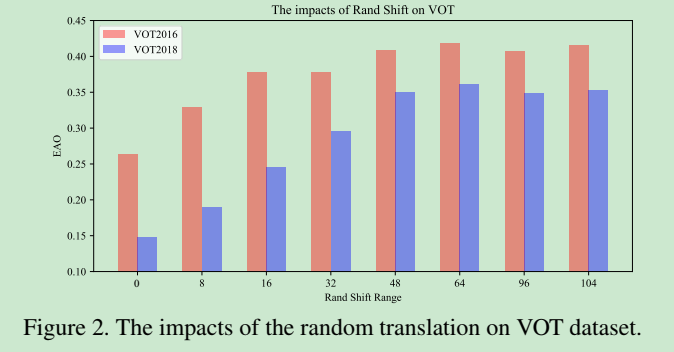
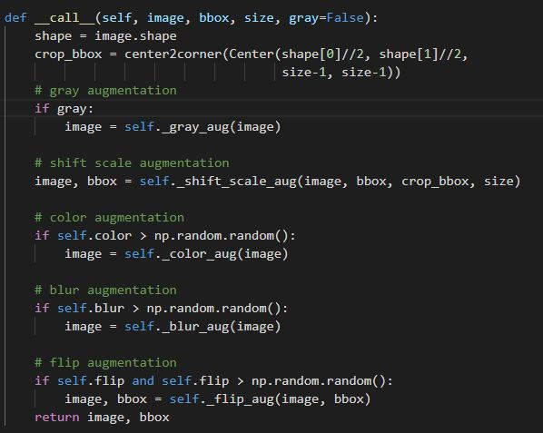
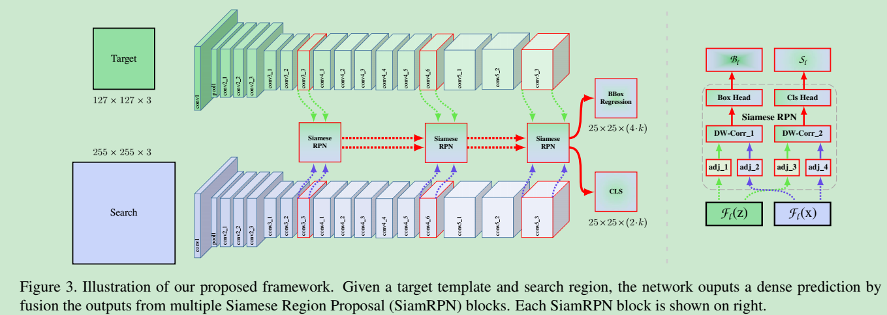
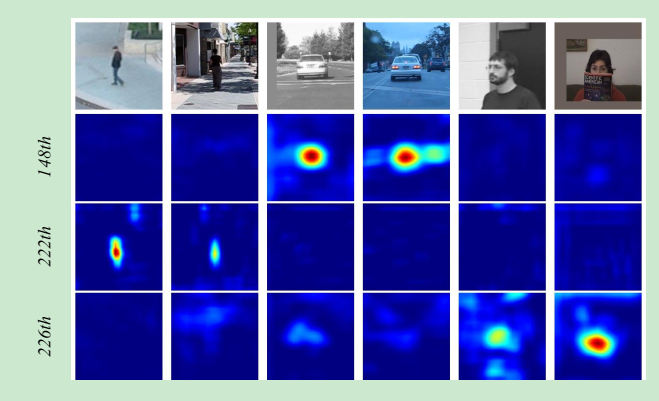
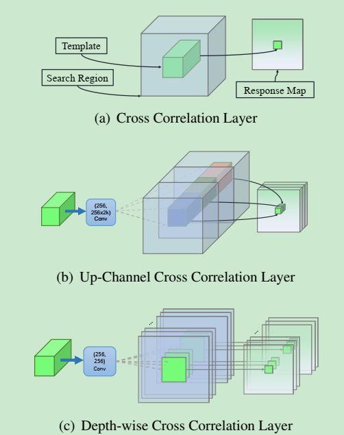

<!-- theme: uncover -->

# SiamRPN++论文+源码阅读

#### 姜山
#### 2019.09.02

---
<!-- page_number: true -->
CVPR 2019: SiamRPN++: Evolution of Siamese Visual Tracking with Very Deep Networks

https://github.com/STVIR/pysot
包括以下算法的实现
- SiamRPN
- DaSiamRPN
- SiamRPN++
- SiamMask
---
<!-- page_number: true -->
## 孪生网络跟踪的局限性分析
- 要求严格的位移不变性
	$f(\mathbf{z},\mathbf{x}[\Delta \tau_j])=f(\mathbf{x},\mathbf{z})[\Delta \tau_j]$
   要求网络中不能有padding，限制了更深层的网络(如ResNet)在跟踪中的应用
    
- 对称性结构
	$f(\mathbf{z},\mathbf{x})=f(\mathbf{x},\mathbf{z})$
    适用于similarity learning，限制了在跟踪任务中的性能。
---
## Spatial aware 采样策略
- 打破位移不变性会导致空间偏见(spatial bias)
- 模拟实验：用不同随机位移范围的数据训练网络，将网络在测试集上的heatmap叠加，来观察结果。
- 在没有对训练样本进行随机位移扩充的情况下，训练的网络有center bias

- 实验：使用ResNet50作为SiamRPN的backbone，在VOT2016和VOT2018数据集上测试效果
---

---
---
## 如何实现
- 在训练中对数据进行扩充，在Dataset类中实现

---
## 如何实现
- 所有样本经过位移和缩放的扩充
- 样本以一定概率经过模糊和颜色的扰动

---
## 为跟踪任务设计的ResNet
- 原版ResNet stride为32，不适用于跟踪任务
- 将最后两层stride减为8，并改用空洞卷积来增大感受野。
- 为减轻计算负担，裁剪中心7x7区域作为模板特征
- 模板分支：127x127--->15x15
- 搜索分支：255x255--->31x31
- 最终特征图大小：31-7+1--->25x25
---

---
---
## Layer-wise Aggregation
- 不同层的特征表达差别很大
- 浅层特征包含更多空间信息，深层特征包含更多语义信息
- ResNet的各中间层输出通过一个调整卷积层(conv-bn block)，将通道数统一调整为256
- 浅层特征与深层特征分别进行cross-correlation，结果通过可学习的权重加权融合。
- 分类分支与边框回归分支权重不同。
---
## Depth wise cross correlation
- SiamRPN中UpChannel Cross Correlation使RPN部分的参数量过大，影响效果(RPN 20M, Backbone 4M)。
- 提出逐层互相关，参数量降低十倍。
- 模板分支与搜索分支通过的卷积层不共享（不对称）。
- 逐层卷积后，用一个conv-bn-relu模块融合不同层特征，再经过一个卷积层输出最终特征。
- 有趣现象：不同通道特征包含类别信息。
---

---
---

---
---
## 实现

---
---
## 其他
- Anchor的默认宽高比：[0.33, 0.5, 1, 2, 3]，只有一个默认尺度。
- 与检测的区别：二分类，没有ROI Pooling
- 训练阶段标签：与目标IOU大于$t_{high}$的anchor标记为+1，小于$t_{low}$标记为-1。
- 跟踪阶段: 对较大的尺度宽高比变化惩罚后，从分类分支中选择分数最大的anchor，同时从边框回归分支中取出对应的预测边框位置。
---
## 其他
- 如何实现长时跟踪: 定义跟踪置信度阈值confidence high(0.998)和confidence low(0.85)，当置信度(分类分支响应)小于confidence low时，进入丢失重检测状态，搜索区域扩大为831，若置信度高于confidence high，切回正常跟踪状态。
- hp_search：在VOT数据集上搜索最佳超参数。