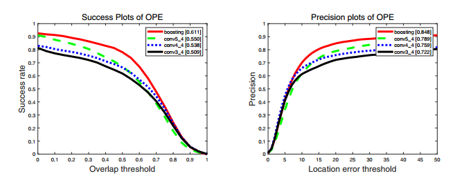
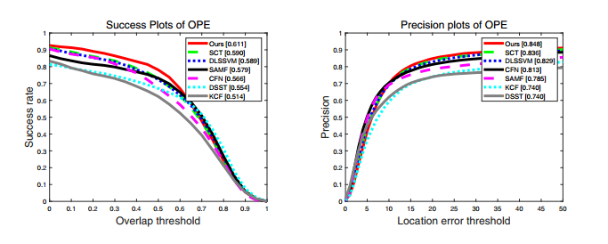
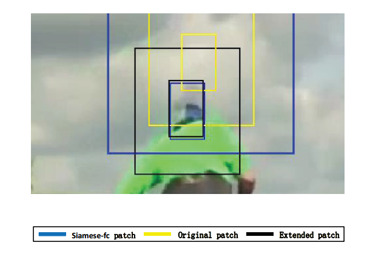
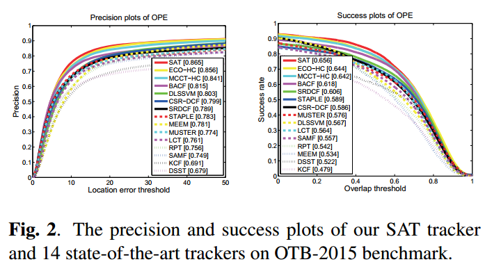

# ICIP 2019 跟踪论文阅读
#### 姜山
#### 2019.10.14
---
## 目录
- 相关跟踪中的模型更新机制
- Boosting + Correlation filter
- Spatial-aware tracker
---
## 相关跟踪中的模型更新机制
- 线性更新(固定更新率)
- 时域正则项(在线被动攻击(PA)学习) [1]
- 在线高斯混合模型 [2]

  [1] K. Crammer, O. Dekel, J. Keshet, S. Shalev-Shwartz, and Y. Singer. Online passive-aggressive algorithms. JMLR,7(3):551–585 2006. 2, 4
  [2] A. Declercq and J. H. Piater. Online learning of gaussian mixture models - a two-level approach. In VISAPP, 2008. 5
---
## 相关跟踪中的模型更新机制
- 在线被动攻击学习：新学习到的权重(滤波器)要对当前示例分类正确，并且要尽可能接近原有权重，从而能保留之前学习到的信息。
- 在线混合高斯模型：维护一个大小为N(=30)的样本库($\mathbf{x}_k$)和权值库($\alpha_k$)，记更新学习率为$\eta$
---
## 相关跟踪中的模型更新机制
- 更新方式：
    1. 若样本库不满，将新样本加入样本库，新样本权值赋为$\eta$，旧权值乘以$(1-\eta)$
    2. 若样本库已满，其中一个样本权值小于预设定的遗忘阈值，用新样本代替该样本，权值赋为$\eta$
    3. 若样本库已满，新样本与所有旧样本的最小距离小于旧样本两两之间的最小距离，将新样本距离最近的旧样本加权融合，权值相加。
    4. 若样本库已满，新样本与所有旧样本的最小距离大于旧样本两两之间的最小距离，加权融合最近的两个旧样本，将新样本插入到新位置。
---
## 相关跟踪中的模型更新机制
- 实现方式：
    1. 维护一个$N\times N$的gram矩阵G和距离矩阵D
    2. $G_{ij} = \mathbf{x}_i^T \mathbf{x}_j$
    3. $D_{ij} = ||\mathbf{x}_i - \mathbf{x}_j||^2$
    4. $D_{ij} = ||\mathbf{x}_i||^2 + ||\mathbf{x}_j||^2 - 2G_{ij}$
- 优化目标函数(每隔5帧训练一次，防止过拟合)
    $$h = \underset{h}{argmin} \sum_{k=1}^N \alpha_k||\sum_{l=1}^d h_l * x_{kl} - y||^2 + \lambda \sum_{l=1}^d||h_l||^2$$ 
---
## Boosting + Correlation Filter
- BOOSTING CORRELATION FILTER BASED TRACKING USING MULTI CONVOLUTIONAL FEATURES
- Boosting: 集成学习方法，多个有差异的弱分类器结合成强分类器。（“三个臭皮匠，顶个诸葛亮”）
- 分类误差较小的分类器在最终分类结果中增大权重。
- 错分的样本在下一轮学习中增大权重。
- 集成$m$个弱相关滤波的响应，从加权响应和中估计目标位移。
$$r_w = \sum_{i=1}^m w_i r_i$$
---
## Boosting + Correlation Filter
(T通过大津阈值法从响应图得出)
$$h(x) = \begin{cases}
1\quad \rm{if}\ \it x>T \\
-1\quad \rm{Otherwise}
\end{cases}
$$
响应图上每个像素值为都是对目标的一个循环移位的分类结果
第$i$个分类器正确率$p_i=sum(\beta_i \odot \delta(h(r_w)\odot h(r_i)))$
在下一轮迭代中增大对错分样本的权重
$$\beta_{i+1}=\frac{1}{Z_{\beta}}\beta_i e^{-w_i h(r_w) h(r_i)}$$
---
## Boosting + Correlation Filter
在下一轮迭代中更新各个弱分类器的权重。
$$w_i^{new} = \frac{1}{Z_w} \log{\frac{p_i}{1-p_i}}$$
- 实验：结合三个CF跟踪器，分别使用VGG-19的conv3_4, conv4_4, conv5_4。
- 三个系数初始化为[0.33 0.33 0.33]
- 每帧在检测阶段迭代三次。
---
## Boosting + Correlation Filter
- 实验： 融合前与融合后对比

---
## Boosting + Correlation Filter
- 实验： 其他跟踪器对比

---
## Spatial-aware tracker
- A SPATIAL-AWARE TRACKER
- Siamese跟踪器与K=7个CF跟踪器结合，自适应选择搜索范围。
- 记第T帧Siamese跟踪器最大响应为$\rho_T$, 若$\rho_T<\beta M$, M为Siamese响应的历史均值，搜索范围扩大到四倍。$\beta$取值自适应调整。
- 衡量检测到的目标位置与上一帧目标位置的相对距离。
    $$D^r(p_s, p_{T-1})=\frac{D(p_{T-1}, p_s)}{\sqrt{w_{T-1}*h_{T-1}}}$$
    若与上帧相对距离大于一定阈值，使用相关滤波器判断是否选择此结果。
--- 
## Spatial-aware tracker
- 使用相关滤波器辅助判断是否应该选择Siamese跟踪器的结果。
- 原始目标状态记为$S_o$，Siamese跟踪器得到的目标状态记为$S_e$。
$$
Score(S_o) = \gamma R(S_o) + (1-\gamma) C(S_o)
$$
- $R(S_o)$为K个CF相应最大值平均值。
- $C(S_e)$为K个CF预测位置两两之间IOU平均值。
- 最终位置得分
    $$Score(S_e)=exp(-D^r(p^o_T,p^e_T)*w)*Score(S_e)$$
---
## Spatial-aware tracker
- 选择分数较大的位置作为目标状态。

---
---
## Spatial-aware tracker
- 实验结果

---
## 主要问题
- 提升性能的方法创新性不够（A方法的A1模块嵌入B方法）
- 如何寻找创新点(创新点往往来源于方向外？)
- 实验做到什么程度可以开始写论文