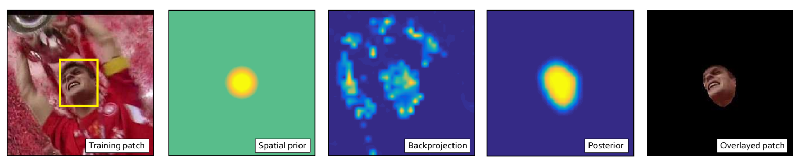
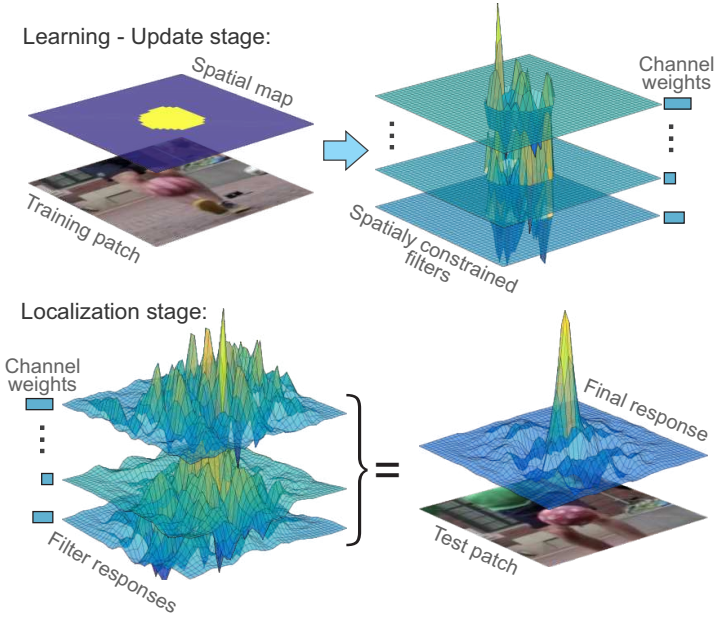
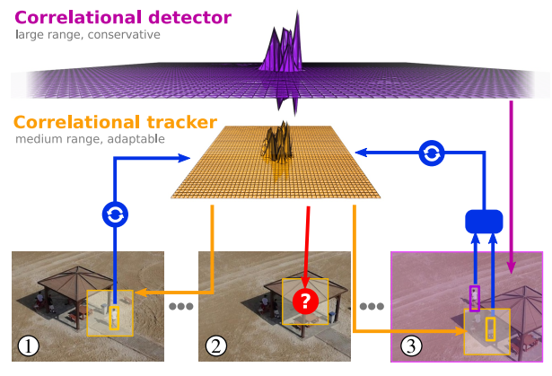

# 基于相关滤波的长时跟踪
#### 姜山
#### 2019.12.13
---
## 目录
- 1.基于相关滤波的全局丢失重检测
    - 1.1 CSRDCF
    - 1.2 FuCoLoT
- 2.实验进展 
---
## 基于相关滤波的全局丢失重检测
### CSRDCF
* CVPR2017: Alan Lukezic *et al*: Discriminative correlation filter with channel and spatial reliability
* 解决边缘效应, 提出空域可靠性和通道可靠性
* 使用HSV颜色模型计算空域可靠性

---
## 基于相关滤波的全局丢失重检测
### CSRDCF
* 每个通道滤波器使用ADMM算法单独求解
$$
L(\mathbf{h}_c, \mathbf{h}, \hat{\mathbf{l}}|\mathbf{m})=||\hat{\mathbf{h}_c}^Hdiag(\hat{\mathbf{f})}-\hat{\mathbf{g}}||^2+\frac{\lambda}2||\mathbf{h}_m||^2+\\
[\hat{\mathbf{l}}^H(\hat{\mathbf{h}}_c-\hat{\mathbf{h}}_m)+\bar{\hat{\mathbf{l}}^H(\hat{\mathbf{h}}_c-\hat{\mathbf{h}}_m)}]+\mu||\hat{\mathbf{h}}_c-\hat{\mathbf{h}}_m||
$$
* 每个通道的响应按通道可靠性加权相加
* 通道可靠性：滤波器对学习样本的响应最大值(学习阶段)，滤波器对检测样本的响应的主峰和次峰比(检测阶段)
---

---
---
## 基于相关滤波的全局丢失重检测
### FuCoLoT
* ACCV2018: Alan Lukezic *et al*: FuCoLoT-A Fully-Correlational Long-Term Tracker
* 解决目标长时遮挡，出视野后恢复的问题
* 跟踪置信度：$q_t = \rm{PSR}(\mathbf{r}_t)*max(\mathbf{r}_t)$
* 若历史平均置信度与当前置信度的比超过一定阈值，则认为当前跟踪结果不可靠 $\bar{q}_t/q_t>\tau_q$
* 跟踪结果不可靠时，使用长时检测器进行全局重检测
---
* 重检测运动模型：随机游走模型
$\pi(\mathbf{x}_t)=N(\mathbf{x}_t;\mathbf{x}_c,\Sigma_t), [\sigma_{xt},\sigma_{yt}]=[x_w,x_h]\alpha_s^{\Delta_t}$

---
## FuCoLoT
* 多尺度重检测：{0.5, 0.7, 1, 1.2, 1.5, 2}
* 全局检测器保守更新：{0, 1/250, 1/50; 1/10, 1}(保留第一帧模型防止污染)
* 每帧重检测更换一个尺度和检测器
* 在重检测结果上重新运行短时跟踪器，若置信度大于跟踪结果，采用重检测结果
* 若重检测结果置信度大于一定阈值，恢复短时跟踪，停止重检测
* 在UAV20L上的AUC达到0.533
---

---
---
# 实验进展
* 在中期工作的基础上，增加了全局丢失重检测。
* 在跟踪过程中，维护目标样本库，在跟踪置信度低时，使用维护的目标样本库训练BACF用于全局重检测
* 主要问题：跟踪规则的制定，如何准确判断跟踪失败，何时开启重检测，如何准确恢复跟踪
---
# 实验进展
$\tau(R)=\max(R)APCE(R)$
$\frac{\tau(R_{CF})}{\bar{\tau}(R_{CF})}<T_{CF}, \frac{\tau(R_{CR})}{\bar{\tau}(R_{CR})}<T_{CR},\frac{\tau(R)}{\bar{\tau}(R)}<T_{R}$
* 以上三个条件均成立时，判定当前跟踪结果不可靠
* 跟踪结果不可靠超过连续5帧时，进入丢失重检测状态
* 若重检测结果置信度大于跟踪置信度，输出重检测位置
---
# 实验进展
* 若重检测置信度较高，恢复短时跟踪状态
$\frac{\tau(R_{CF})}{\bar{\tau}(R_{CF})}\geq T_{CF}, \frac{\tau(R_{CR})}{\bar{\tau}(R_{CR})}\geq T_{CR},\frac{\tau(R)}{\bar{\tau}(R)}\geq T_{R}$
* 在丢失重检测状态中，若短时跟踪结果连续5帧可靠，恢复短时跟踪状态
* 取得一定效果，解决了一部分目标长时遮挡，出视野的问题，在UAV20L上的AUC达到0.524
* 进一步优化，改进规则
---